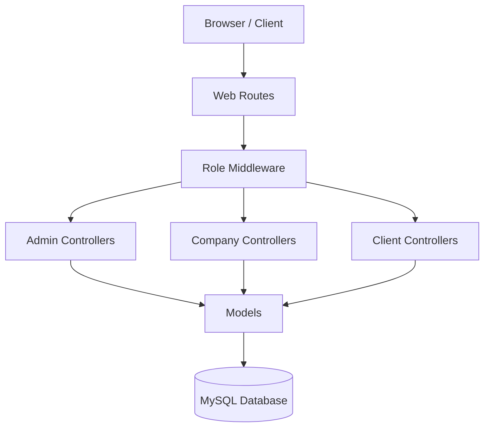

# System Architecture

## 1. High-Level Diagram
The system relies on a monolithic Laravel application structure with a MySQL database.

## 2. Database Schema (Key Entities)

### Core
-   `users`: Base user table.
-   `web_profiles`: Configuration for website branding (Logo, Contact, SEO).
-   `menus`: Dynamic menu management.

### Locations (Admin Managed)
-   `provinces`: Top-level locations (Cities/Provinces).
-   `districts`: Sub-level locations.
-   `stops`: Specific physical locations (Bus stations, offices).
-   `routes`: Generic connection between two Provinces (e.g., Hanoi -> Sapa).

### Transport (Company Managed)
-   `companies`: Bus operators. Linked 1-1 to a `User` (manager).
-   `buses`: Vehicles owned by a company.
-   `bus_services`: Amenities (Wifi, AC, etc.).
-   `company_routes`: Specific implementation of a generic `route` by a company (e.g., "KingExpress Hanoi-Sapa Morning").
-   `company_route_stops`: Ordered list of stops for a specific company route.
-   `bus_routes`: **The Schedule/Trip**. Connects a `bus` to a `company_route` with `start_time`, `end_time`, and `price`.

### Booking
-   `bookings`: Connects `user` (optional) to `bus_routes`.
    -   Tracks `pickup_stop_id`, `dropoff_stop_id`.
    -   Statuses: `pending`, `confirmed`, `cancelled`, `completed`.

## 3. Key Relationships

-   **User <-> Company:** 1-to-1. A user manages one company.
-   **Route <-> CompanyRoute:** 1-to-Many. One generic route (Hanoi-Sapa) can be serviced by many companies.
-   **CompanyRoute <-> BusRoute:** 1-to-Many. A specific route pattern can have multiple daily trips (schedules).

## 4. Security & Access Control
-   **Admin Access:** Full CRUD on Master Data (`provinces`, `routes`) and oversight of all `companies`.
-   **Company Access:** CRUD on their own `buses`, `company_routes`, `bus_routes`. Cannot modify Master Data.
-   **Customer Access:** Read-only on Routes/Schedules. Write access to `bookings` (creation) and `users` (own profile).
